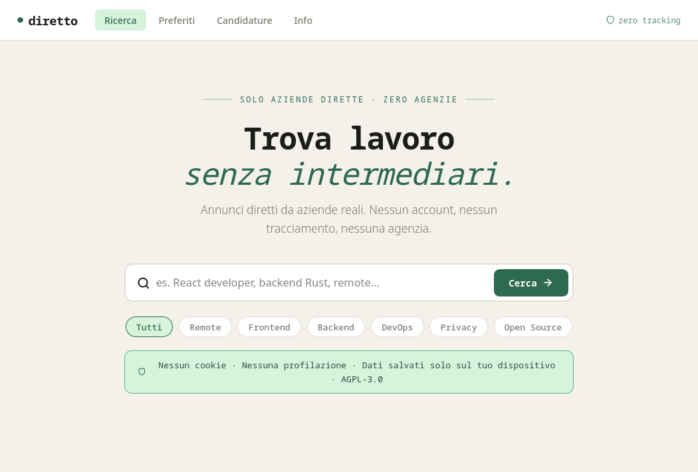

> 🚧 Lavori in corso! Questo progetto è attualmente in fase alpha — alcune cose potrebbero rompersi, cambiare o scomparire.

# Diretto

> Cerca lavoro, non inserzionisti.



Piattaforma di ricerca lavoro **privacy-first**, **open source**, **senza agenzie**.
Solo annunci pubblicati direttamente dalle aziende sul loro sito.

## Caratteristiche

- 🔍 Motore di ricerca full-text su annunci aziendali diretti
- 🏢 Zero agenzie interposte — filtro automatico
- 🔒 Nessun account, nessun tracciamento, nessun cookie
- ❤️ Preferiti e tracker candidature locali (localStorage)
- 🐳 Self-hostabile con un comando

---

## Sviluppo locale

### Prerequisiti

- Docker + Docker Compose
- Git

### Avvio

```bash
git clone https://github.com/caprosoft/diretto.git
cd diretto
cp .env.example .env      # imposta DB_PASSWORD
docker compose up -d
```

I quattro servizi si avviano in ordine automatico:

| Servizio | URL locale |
|---|---|
| Frontend | http://localhost:3000 |
| API | http://localhost:8000 |
| Docs API | http://localhost:8000/api/docs |
| Database | localhost:5432 |

Il crawler parte in automatico e scansiona le aziende nel seed.
Il primo giro richiede qualche minuto — dopo trovi gli annunci nel frontend.

### Stop

```bash
docker compose down          # ferma i container, i dati nel db rimangono
docker compose down -v       # ferma tutto e cancella il database (reset completo)
```

### Comandi utili

```bash
# Log in tempo reale
docker compose logs -f

# Log di un singolo servizio
docker compose logs -f crawler
docker compose logs -f api

# Forza un crawl immediato senza aspettare 24h
docker compose exec crawler python -c \
  "from crawler.main import crawl_all; import asyncio; asyncio.run(crawl_all())"

# Rebuild dopo modifiche al codice
docker compose up --build -d

# Stato dei servizi
docker compose ps
```

---

## Trasparenza delle fonti

Diretto non crea né ospita annunci di lavoro propri.
Ogni annuncio è scansionato direttamente dal sito ufficiale dell'azienda.

La lista completa delle aziende indicizzate è pubblica e versionata nel repo:

👉 [`data/seeds/companies.yaml`](data/seeds/companies.yaml)

Per ogni annuncio mostrato nel frontend è sempre visibile:
- il **dominio sorgente** (es. `careers.basecamp.com`)
- il **link diretto** all'annuncio originale sull'azienda
